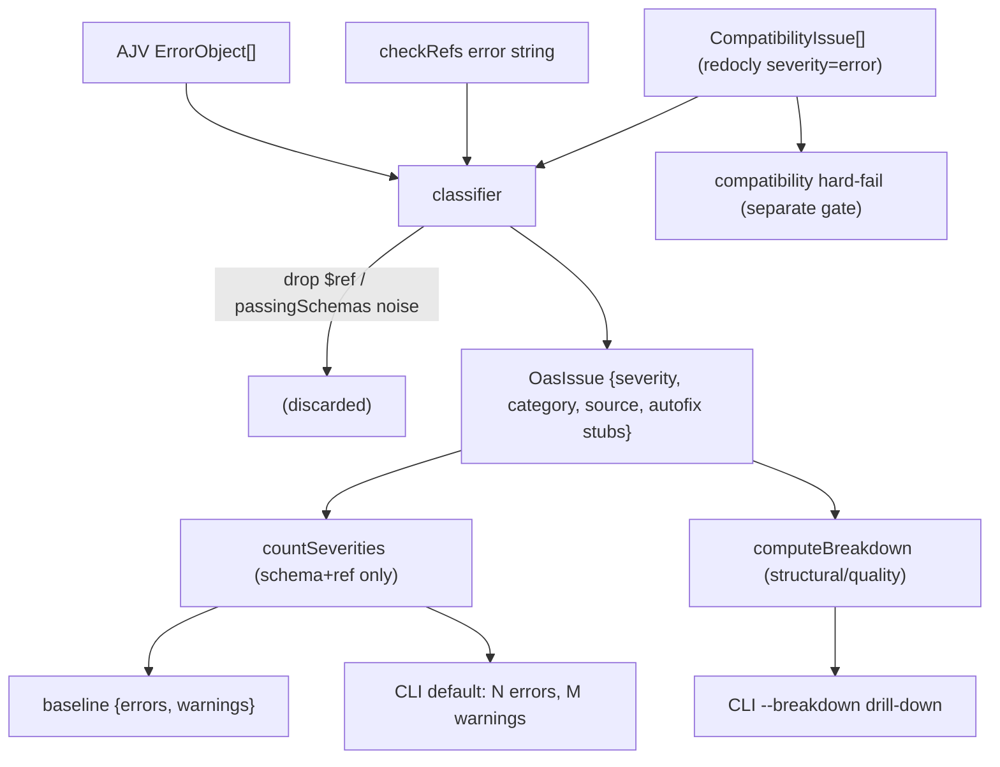

> Full path prefix omitted below for brevity: all `src/...` paths are under `/Users/christianeheiligers/Projects/kibana/`. Package root = `src/platform/packages/private/kbn-validate-oas/`.

# 1. Executive summary

Ship a **layered issue taxonomy** in `@kbn/validate-oas`. A new classifier turns every finding into an `OasIssue` tagged with two axes: **severity** (`error` | `warning`, the default surface and CI gate) and **category** (`structural` | `quality`, an internal drill-down). **Policy v1:** structural findings are errors, quality findings (missing `description`/`summary`/`example`/`examples`) are warnings. The baseline JSON migrates from `{ path: number }` to `{ path: { errors, warnings } }`, and `--assert-no-error-increase` fails if **either** count rises per bundle (today only the flat total gates, so a category swap can slip through). A new `--breakdown` flag prints structural/quality subtotals inside each severity bucket. Deferred: policy tuning per rule, surfacing Redocly `warn` issues, fix suggestions, autofix, and skill/`SKILL.md` updates (follow-up PR).

**Decision:** implement on current `main`, not by rebasing the Jul 9 spike (`kbn-oas-baseline-categories-2026-07-09`, 532 commits behind). **Rationale:** the spike gated on total only and predates unrelated churn; recreating a small, focused classifier is faster and lower-risk than a 532-commit rebase. **Alternative considered:** cherry-pick `error_categorization.ts` from the spike — rejected because its design (categorized baseline gating on total) diverges from the approved severity-first design.

# 2. Target data model

New module `src/error_categorization.ts` defines:

```ts
export type IssueSource = 'schema' | 'compatibility' | 'ref-resolution';
export type IssueSeverity = 'error' | 'warning';
export type IssueCategory = 'structural' | 'quality';

export interface OasIssue {
  path: string;          // AJV instancePath or normalized Redocly pointer
  message: string;
  schemaPath?: string;   // AJV schemaPath (undefined for ref/compat)
  source: IssueSource;
  severity: IssueSeverity;
  category: IssueCategory;
  // --- future autofix stubs (declared, unused in v1) ---
  ruleId?: string;
  suggestedFix?: string;
  autofixable?: boolean;
}

export interface SeverityCounts {
  errors: number;
  warnings: number;
}

// opt-in breakdown only; not persisted
export interface CategoryBreakdown {
  errors: { structural: number; quality: number };
  warnings: { structural: number; quality: number };
}

export type Baseline = Record<string, SeverityCounts>;
```

**Baseline shape — Decision:** `{ "<bundlePath>": { "errors": N, "warnings": M } }`. **Rationale:** severity is what CI gates and what devs act on; storing exactly the two gated numbers keeps the baseline minimal and the gate unambiguous. Because policy v1 is a strict 1:1 map (structural↔error, quality↔warning), these two numbers already encode the issue's "structural vs quality" intent without a second nested layer.

**Store category subtotals in the baseline? Decision: NO — compute-only on `--breakdown`.** **Rationale:** in v1 the category subtotal within a bucket is fully derivable from the severity bucket (1:1 map), so persisting it is redundant and would create a second gate that drifts. Keeping category out of the baseline means policy v2 (when the 1:1 map breaks) won't force a second migration. **Alternative considered:** nested `{ errors: {structural, quality}, warnings: {...} }` persisted + gated — rejected as premature double-gating; revisit when policy v2 lands.

**Future autofix:** `ruleId` / `suggestedFix` / `autofixable` are declared on `OasIssue` now (populated as `undefined`) so a later PR can attach suggestions/autofix without changing the aggregation or CLI plumbing.

# 3. Classification policy table

Classifier input is the union of: AJV `ErrorObject[]` (schema), the `checkRefs` string error (ref-resolution), and `CompatibilityIssue[]` (compatibility). Rules, in order:

- **AJV, `keyword === 'required'` and `params.missingProperty ∈ {description, summary, example, examples}`** → `category: quality`, `severity: warning`, `source: schema`.
- **AJV, `params.missingProperty === '$ref'`** → **dropped** (not an issue). Preserves the existing `cli.ts:103` noise filter; `$ref` is an optional optimization, never required by the spec.
- **AJV, `params.passingSchemas === null`** → **dropped** (existing `anyOf`/`oneOf` aggregate noise filter from `cli.ts:104`).
- **AJV, everything else** (`additionalProperties`, `type`, `enum`, `minProperties`, polymorphic shape, non-doc `required`, etc.) → `category: structural`, `severity: error`, `source: schema`.
- **Ref-resolution** (`checkRefs` returns `{ valid:false, errors: string }`, e.g. `Can't resolve ...`) → single `OasIssue`, `category: structural`, `severity: error`, `source: ref-resolution`.
- **Compatibility** (Redocly, already pre-filtered to `severity === 'error'` in `compatibility.ts:49`) → `category: structural`, `severity: error`, `source: compatibility`.

Edge cases:
- **Property literally named `description` that isn't doc-completeness:** classified by `missingProperty` name only → treated as `quality/warning`. v1 accepts possible over-classification; documented limitation. (In OAS 3.0 the `required: description` cases we hit are genuine doc-completeness, e.g. Response Object.)
- **Unresolved `$ref`:** structural/error (see ref-resolution rule). Distinct from the dropped `missingProperty: '$ref'` AJV noise — different mechanism, different meaning.
- **Compatibility warnings vs errors:** Redocly `warn` problems are already discarded upstream in `compatibility.ts`; **v1 does not surface them.** All surfaced compatibility issues are `error` severity → structural/error. Follow-up may map Redocly `warn` → `warning`.
- **Are compatibility issues always structural/errors?** In v1, **yes.** **Decision:** classify all compatibility issues structural/error, but **exclude them from baseline severity counts** — they keep their existing independent hard-fail path (see §5). This preserves "compatibility-only failures behave as today."

# 4. File-by-file change list (in implementation order)

1. `src/error_categorization.ts` **(new)** — types from §2 plus:
   - `classifySchemaError(error: ErrorObject): OasIssue | null` (null = dropped noise). Named for the `source: 'schema'` axis, not the validator, so swapping AJV for another schema validator later needs no rename; the `ErrorObject` param type stays AJV-specific for now.
   - `classifyRefError(message: string): OasIssue`.
   - `classifyCompatibilityIssue(issue: CompatibilityIssue): OasIssue`.
   - `countSeverities(issues: OasIssue[]): SeverityCounts` (schema+ref only, for baseline).
   - `computeBreakdown(issues: OasIssue[]): CategoryBreakdown`.
   - Baseline helpers: `isNewBaselineShape(value): value is Baseline`, and a guard that detects the legacy `{ path: number }` shape.
2. `src/error_categorization.test.ts` **(new)** — unit coverage per §7.
3. `src/cli.ts` — replace the flat `schemaErrorCount` counting with: build `OasIssue[]` per bundle via the classifier, keep the existing `instancePathFilters` filtering (apply to `OasIssue.path`), derive `{errors,warnings}` for the baseline, add `--breakdown` rendering, and change the `--assert-no-error-increase` comparison to per-bundle errors-OR-warnings (§5). Keep compatibility as a separate hard-fail. Update `flags`/`help`/`examples`.
4. `src/oas_error_baseline.json` — regenerate to new shape via `--update-baseline` (numbers produced at implementation time; do not hand-edit).
5. `README.md` — brief: document the two axes, policy v1, `--breakdown`, and the new baseline shape.
6. `index.ts` / `src/validate.ts` — **exports:** keep `index.ts` as the CLI entry (`import './src/cli'`); do **not** add public re-exports. Tests import classifier symbols directly from `./error_categorization`. `validate.ts` unchanged (still returns raw `ErrorObject[]` / ref string; classification happens in the CLI layer). **Rationale:** package is `devOnly` with no external importers; adding a public surface is unneeded scope.
7. `src/compatibility.ts` — **no functional change** in v1. Add an inline note that Redocly `warn` is intentionally dropped and is a follow-up. Flag: if a reviewer wants warns surfaced, that is a scope change (deferred).

# 5. CLI behavior spec

**Default (no flags):** per bundle, print `N error(s), M warning(s)` where N = structural (schema+ref) count, M = quality count. Full issue text still printed unless `--skip-printing-issues`. Compatibility issues printed and counted separately as today.

**`--skip-printing-issues`:** suppress per-issue text; still print the per-bundle `N errors, M warnings` summary line (and compatibility summary line).

**`--breakdown` (chosen flag name):** additionally print category subtotals nested under each severity bucket, e.g. `errors: 1 (structural 1, quality 0)`, `warnings: 16 (structural 0, quality 16)`. Absent → current-style output. Independent of other flags.

**`--assert-no-error-increase`:** per-bundle compare `curr` vs `baseline[path]`. **Fail (exit 1) if `curr.errors > prev.errors` OR `curr.warnings > prev.warnings`.** Report each bundle with color per axis (red rise / yellow flat / green drop). This closes the current gap where a flat total hides a category swap across severity buckets. Compatibility failures remain an independent hard-fail (exit 1) exactly as today, evaluated in this branch. `--path` remains incompatible with this flag (existing guard at `cli.ts:36`).

**`--update-baseline`:** always writes the new `{errors,warnings}` shape. When combined with `--assert-no-error-increase`, only writes when no increase (unchanged sequencing).

**`--path` / `--only`:** unchanged constraints — `--only` must be `traditional|serverless`; `--path` filters issues by `instancePath`/pointer prefix and cannot combine with `--assert-no-error-increase`.

**Exit codes:** `0` = valid / no increase; `1` = invalid spec, error/warning increase, compatibility failure, or bad baseline shape.

**Example stdout — bundle with 1 error + 16 warnings:**

Default:
```
./oas_docs/output/kibana.yaml: 1 error, 16 warnings
```
With `--breakdown`:
```
./oas_docs/output/kibana.yaml
  errors:   1  (structural 1, quality 0)
  warnings: 16 (structural 0, quality 16)
```

# 6. Baseline migration strategy

**Decision: hard-fail on legacy shape; no silent auto-migration.** On any read (`--assert-no-error-increase`), detect legacy `{ path: number }` and exit 1 with:
```
oas_error_baseline.json uses the old flat format. Regenerate it with:
  node ./scripts/validate_oas_docs.js --update-baseline
```
**Rationale:** the baseline is committed and CI auto-commits it; silently rewriting during an assert run could mask a real regression during the transition. **Alternative considered:** transparent one-time upgrade — rejected for that masking risk.

Migration executed within this PR: run `--update-baseline` once to regenerate `oas_error_baseline.json` in the new shape and commit it. In CI, the committed baseline is already new-shape post-merge, so the hard-fail path never triggers there.

# 7. Test matrix

**Unit — `node scripts/jest src/platform/packages/private/kbn-validate-oas/src/error_categorization.test.ts`:**
- `required` + `missingProperty: 'description'|'summary'|'example'|'examples'` → quality/warning.
- `additionalProperties` / `type` / `minProperties` / non-doc `required` → structural/error.
- `missingProperty: '$ref'` → dropped (null). `passingSchemas: null` → dropped.
- ref-resolution string (`Can't resolve ...`) → structural/error, source `ref-resolution`.
- compatibility issue → structural/error, source `compatibility`.
- `countSeverities` excludes compatibility-sourced issues; `computeBreakdown` nests correctly.
- baseline shape guards: new shape accepted; legacy `{ path: number }` detected as legacy.

**CLI / integration (manual, documented in PR):**
- errors increase → exit 1; warnings increase → exit 1.
- total flat but one structural error swapped for one quality warning (or vice versa) → exit 1 on the axis that rose.
- `--breakdown` output format matches §5.
- legacy baseline → explicit error message, exit 1.
- compatibility-only failure with no schema increase → exit 1 (existing behavior preserved).

**Existing suites to keep green:** `compatibility.test.ts`, `path_filters.test.ts`, `filters_match.test.ts`, `resolve.test.ts` (run whole package: `node scripts/jest src/platform/packages/private/kbn-validate-oas/`).

# 8. CI / consumer impact

- `.buildkite/scripts/steps/checks/capture_oas_snapshot.sh` — **no script change.** It runs `--assert-no-error-increase --skip-printing-issues --update-baseline`; only the baseline JSON shape changes (regenerated in this PR). The auto-commit `check_for_changed_files` step continues to work.
- `src/platform/packages/shared/kbn-mcp-dev-server/src/tools/run_ci_checks.ts` — only names the command string; no change.
- `.github/CODEOWNERS` — path reference only; no change.
- Downstream break scan: no code parses `oas_error_baseline.json` as flat numbers outside the package. The only readers are the CLI itself and human/skill docs.
- **Skills** (`.agents/skills/validate-oas`, `.agents/skills/debug-oas`, `.claude/...` mirrors, and `extract_structural_oas_issues.js`) — **follow-up PR only.** The debug-oas heuristic overlaps with the new classifier; a later PR should point skills at the package classifier and update baseline-shape references. Note in PR follow-ups; do not touch here.

# 9. Implementation sequence

1. Branch from current `main` (fresh, not the Jul 9 spike).
2. Add `src/error_categorization.ts` (types + classifiers + counters + baseline guards).
3. Add `src/error_categorization.test.ts`; get unit tests green.
4. Refactor `src/cli.ts` to build `OasIssue[]`, derive `{errors,warnings}`, add `--breakdown`, and switch the assert comparison to per-bundle errors-OR-warnings; keep compatibility hard-fail separate; add legacy-baseline guard.
5. Regenerate `oas_error_baseline.json` via `--update-baseline`; commit the new-shape file.
6. Update `README.md` (axes, policy v1, `--breakdown`, baseline shape).
7. Run verification (§10); iterate.

# 10. Verification checklist (in order)

```bash
yarn kbn bootstrap   # only if deps/types complain
node scripts/jest src/platform/packages/private/kbn-validate-oas/
node ./scripts/validate_oas_docs.js --skip-printing-issues
node ./scripts/validate_oas_docs.js --assert-no-error-increase --skip-printing-issues
node ./scripts/validate_oas_docs.js --breakdown
node scripts/type_check --project src/platform/packages/private/kbn-validate-oas/tsconfig.json
node scripts/eslint --fix $(git diff --name-only)
```

# 11. Draft PR skeleton

- **Title:** `[OAS] Layered severity/category taxonomy + per-category baseline gating in @kbn/validate-oas`
- **Summary / motivation:** Closes #265662. Flat error total hides structural-vs-quality regressions; introduce a severity axis (errors/warnings) as the default surface + CI gate and an internal category axis (structural/quality) via `--breakdown`.
- **Design decisions:** layered taxonomy (§ severity default, category opt-in); policy v1 = structural→error, quality→warning; baseline stores `{errors,warnings}` only; compatibility stays an independent hard-fail; legacy baseline hard-fails with guidance.
- **Test plan:** unit classifier matrix; assert increase on each axis; category-swap-under-flat-total; `--breakdown` format; legacy-baseline error; compatibility-only failure preserved. Commands from §10.
- **Follow-ups:** point `validate-oas`/`debug-oas` skills at the package classifier; surface Redocly `warn` as warnings; fix suggestions; autofix; policy v2 (per-rule severity tuning).

# 12. Risks and open questions

- **Issue vs approved design divergence (needs JL awareness, assumed closed):** #265662 text asks to persist per-category subtotals and gate on category increase. The approved direction reframes this onto the severity axis. In v1 the 1:1 policy map makes them equivalent, so the intent is met, but the baseline stores severity, not category. Assumed closed per task assumptions; flag in PR for JL confirmation.
- **Compatibility exclusion from baseline (assumed closed):** compatibility errors remain a separate hard-fail and are NOT in `{errors,warnings}`. This matches today's `errorCounts` (schema-only) and the "preserve compatibility behavior" constraint. Confirm this is desired vs folding compatibility into `errors`.
- **`--breakdown` flag name:** chosen per task; trivially renameable.
- **`description`-as-non-doc over-classification:** documented v1 limitation (§3 edge cases); acceptable pending policy v2.
- **Baseline number churn (one-time vs ongoing):** two distinct things. (a) *One-time migration churn* — the introducing PR flips the file from `{ path: 16 }` to `{ path: { errors, warnings } }`; reviewers should expect a shape change, not just values. Reviewed once, not recurring. (b) *Ongoing churn* — driven by the same underlying AJV/ref findings as today, just split into two buckets, so day-to-day update frequency is essentially unchanged (and slightly lower, since category-swaps now fail the gate instead of silently ratcheting the file). Counts stay deterministic; no new flapping.
- **Why this is a valuable enhancement (not just churn):** today a flat total lets a real regression hide — e.g. adding a structural error while removing a quality warning keeps the total at `16`, so CI passes silently. The split gate fails on the axis that rose and `--breakdown` names *which* axis (structural error vs quality warning), converting an invisible, non-actionable "total went up" into targeted, actionable signal on genuine regressions. The only genuinely new baseline movement is exactly these previously-invisible cases: more signal, not more noise.

## Axis flow


